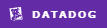

# cdcworker-agaddressen-pub




- Descrição: Solução para captura de registros em tabelas e publicação em tópicos corporativos
- Produto: cdcworker-agaddressen-pub

## Pré-requisitos

:heavy_check_mark: [.NET 8](https://dotnet.microsoft.com/en-us/download/dotnet/8.0)
:heavy_check_mark: [Docker](https://aws-dev.localiza.dev/portal/devops/container/containers-windows01.html?q=docker)

## Como executar

1. Adicionar as variáveis de ambiente no arquivo /src/Labs.IntegracoesDigitais.Cdc.Worker/Properties/launchSettings.json
    ```json
    {
      "environmentVariables": {
        "AMBIENTE": "dev"
      }
    }
    ```
1. Executar o projeto
    - Visual Studio: 
        1. Configurar a solução para inicializar o projeto src/Labs.IntegracoesDigitais.Cdc.Worker/Labs.IntegracoesDigitais.Cdc.Worker.csproj
        1. Build -> Run
    - Comando: 
        ```cmd
        dotnet run --project ./src/Labs.IntegracoesDigitais.Cdc.Worker/Labs.IntegracoesDigitais.Cdc.Worker.csproj
        ```

## Dependências

- **ToDo**: incluir os recursos que a aplicação utilizada como banco de dados, mensageria, cache, relatório e apis

## Referências

- [worker](https://backstage.localiza.com/arte/chapters/engenharia/docs/habilitadores/tecnicas/workers/)
- [.net](https://backstage.localiza.com/arte/chapters/engenharia/docs/habilitadores/frameworks/netcore6)
- [entrypoints](https://backstage.localiza.com/arte/Engenharia/base-cientifica/definicoes-arquiteturais/plataforma/entrypoint/)

---

If you want to learn more about creating good readme files then refer the following [guidelines](https://docs.microsoft.com/en-us/azure/devops/repos/git/create-a-readme?view=azure-devops).  
You can also seek inspiration from the below readme files:
- [ASP.NET Core](https://github.com/aspnet/Home)
- [Visual Studio Code](https://github.com/Microsoft/vscode)
- [Chakra Core](https://github.com/Microsoft/ChakraCore)